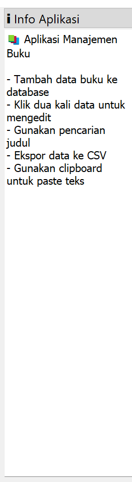
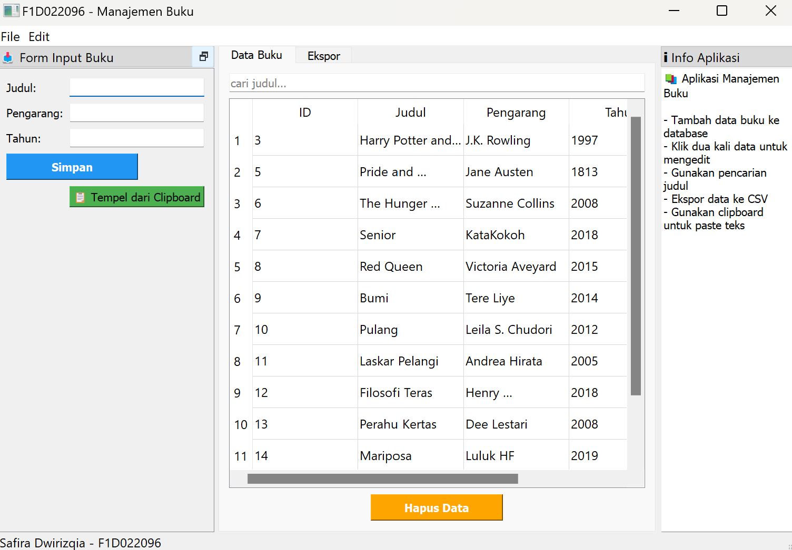
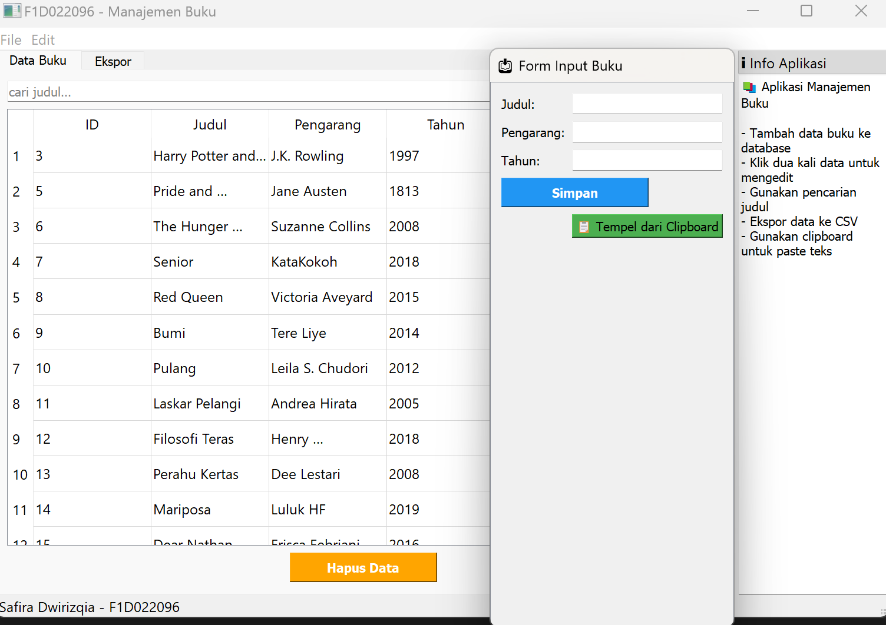
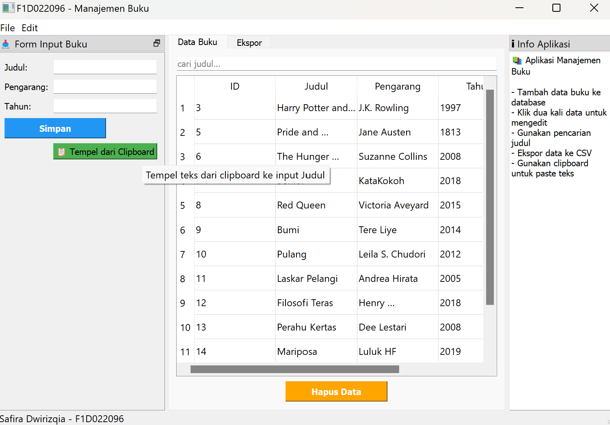
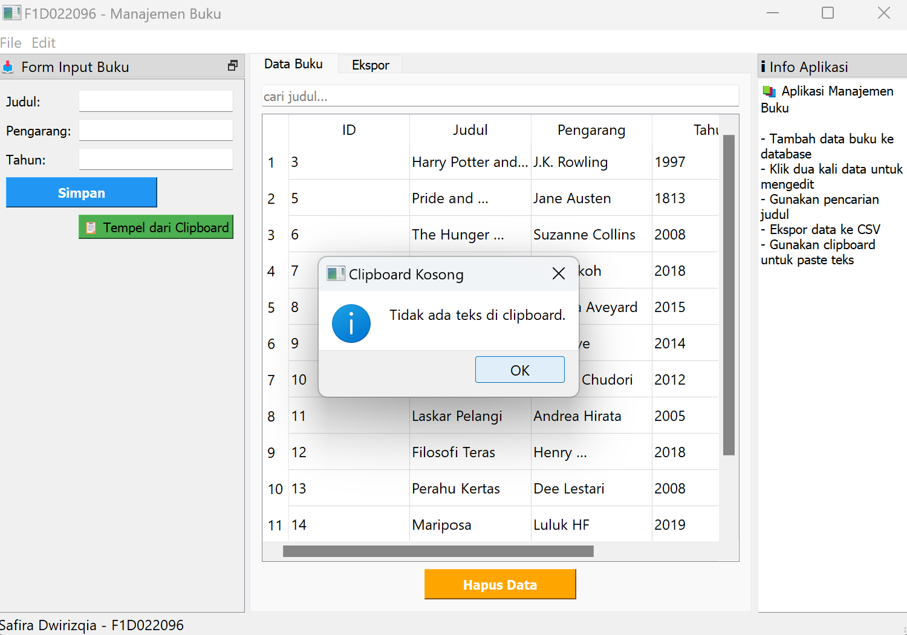
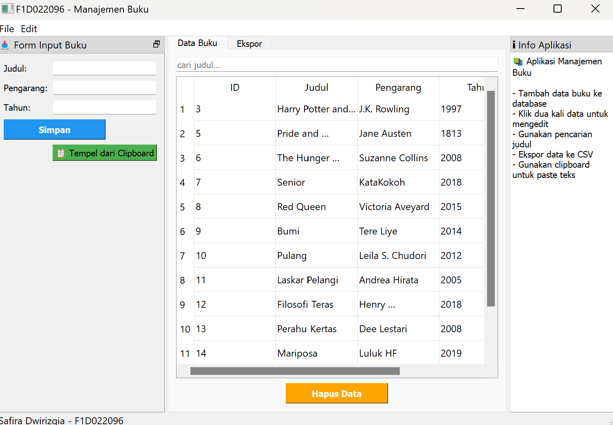
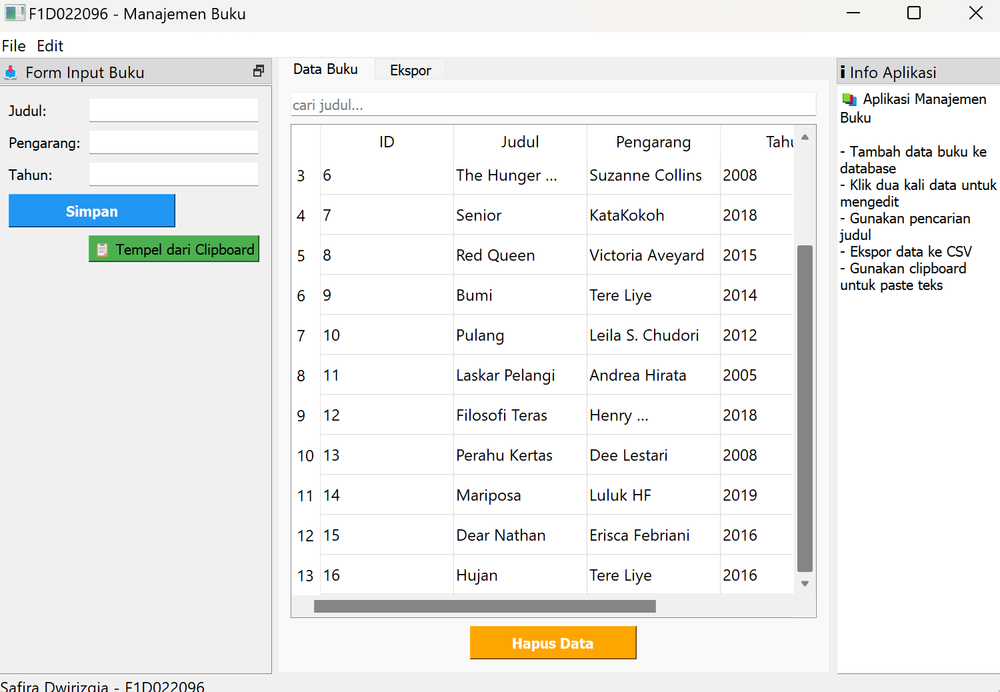
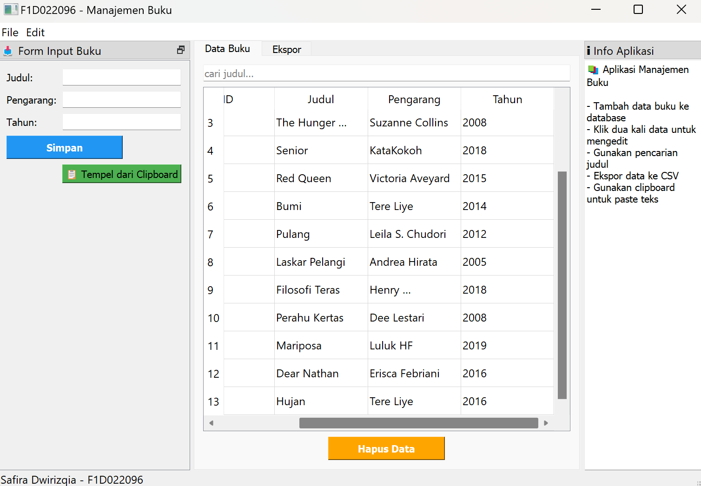

# Assignment Week 11

<table align="center">
  <tr>
    <td align="center" colspan="2">
       
      <b>Tampilan Info Aplikasi yang berisi fitur apa yang bisa dilakukan di aplikasi Manajemen Buku.</b>
    </td>
  </tr>
  <tr>
    <td align="center">
       
      <b>Tampilan sebelum form input buku dipindah dan posisi masih di posisi awal.</b>
    </td>
    <td align="center">
       
      <b>Tampilan setelah form input buku dipindah dan posisi bisa diletakkan dimana saja.</b>
    </td>
  </tr>
  <tr>
    <td align="center">
       
      <b>Tampilan sebelum meng-klik tombol 'Tempel dari Clipboard' isi judul masih kosong.</b>
    </td>
    <td align="center">
       
      <b>Tampilan setelah meng-klik tombol 'Tempel dari Clipboard' isi judul sudah terisi dengan yang ada di Clipboard terakhir.</b>
    </td>
  </tr>
  <tr>
    <td align="center">
       
      <b>Tampilan ketika Clipboard kosong atau tidak ada yang disalin sebelumnya.</b>
    </td>
    <td align="center">
       
      <b>Tampilan status bar yang sudah bertuliskan nama dan NIM.</b>
    </td>
  </tr>
  <tr>
    <td align="center">
       
      <b>Tampilan tabel yang bisa di scroll secara vertikal ketika data buku banyak.</b>
    </td>
    <td align="center">
       
      <b>Tampilan tabel yang bisa di scroll secara horizontal ketika data buku banyak.</b>
    </td>
  </tr>
</table>
